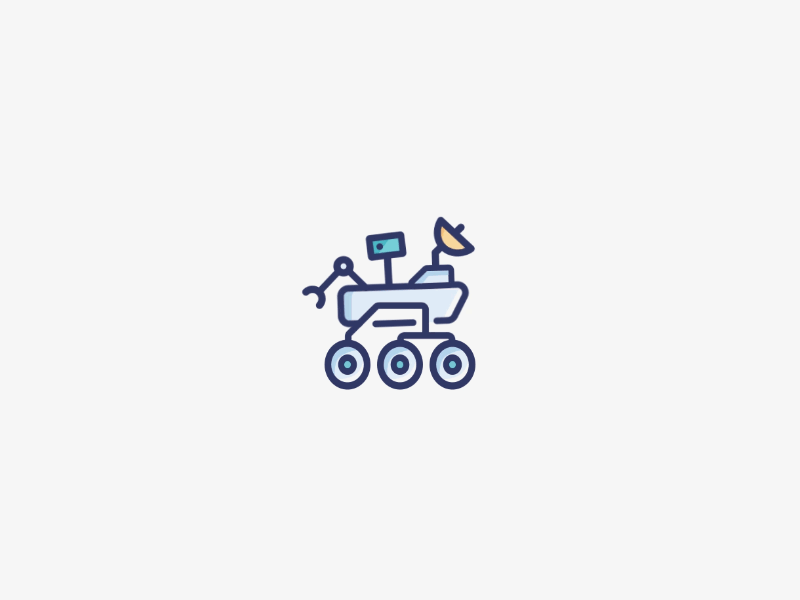

# Hi, I'm Ridwaan Joomun 👋

### 🤖 Mechatronic & Robotic Engineering Student | Robotics | AI/ML | Startups

  
  &nbsp;&nbsp;&nbsp;
  

  <b>Building intelligent systems at the intersection of robotics, AI and hardware.</b>

I'm a Mechatronic and Robotic Engineering student at the **University of Sheffield**.
I'm particularly interested in <b>autonomous robotics, machine learning, computer
vision, embedded systems and entrepreneurship</b>.

---

## 🚀 What I'm Working On

### 🛰️ MarsWorks — Autonomous Mars Rover

I am the Chief Engineer of **[MarsWorks](https://github.com/SheffMarsworks)**,
a student robotics team developing an autonomous Mars rover for international
competitions.

My work focuses on developing the rover's autonomous navigation system, including:

- 🧭 Autonomous navigation and path planning
- 📍 SLAM and localisation
- 👁️ Computer vision and sensor fusion
- 📡 LiDAR-based perception
- 🤖 ROS 2 and Nav2
- 🧪 Simulation with Gazebo
- ⚡ Hardware/software integration
- 🖥️ NVIDIA Jetson Orin NX

I'm also responsible for coordinating the mechanical, robotics, electronics and science development and 
helping drive the team's overall technical direction.

---

## 🛠️ Tech Stack

### 💻 Programming

### 🤖 Robotics & Simulation

### 🧠 AI & Machine Learning

### 🔌 Embedded & Hardware

### 📐 Engineering & Development

---

## 📫 Let's Connect

I'm always interested in collaborating on **robotics, AI, embedded systems and
startup projects**.

Feel free to explore my repositories and see what I'm building!

